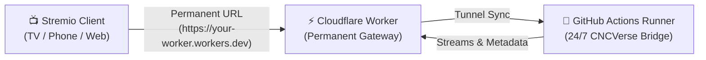

# 🎬 CNCVerse Bridge

[](https://t.me/cncverse)
[](https://workers.cloudflare.com/)
[](https://github.com/features/actions)
[](https://buymeacoffee.com/nivincnc)

An application addon bridge that runs **Cloudstream extensions directly on Stremio, Nuvio, and all Stremio-supported platforms**.

---

## 🌟 Key Features

- **🌐 24/7 Free Cloud Hosting:** Run for free on GitHub Actions + Cloudflare Workers with a permanent `*.workers.dev` URL.
- **⚡ All-Platform Stremio Support:** Works seamlessly on Android TV, Google TV, FireStick, Android, iOS / iPadOS (Stremio Web), Windows, macOS, and Linux.
- **🔄 Always-On Auto Updates:** Extensions automatically update in the background whenever repository updates are released.
- **💾 Full Extension & Data Persistence:** Automatically caches and recovers all your installed `.cs3` plugins and settings across runner restarts.
- **📱 Native Android & Desktop Apps:** Run locally on your phone or PC with one-click Stremio integration.

---

## 🚀 24/7 Free Cloud Deployment (Permanent `workers.dev` URL)

Host your own private, permanent CNCVerse Bridge in the cloud for **100% free** using GitHub Actions and Cloudflare Workers. Your Stremio addon URL will remain permanent and never change!



---

### Step 1: Deploy the Cloudflare Worker Gateway

1. Log into your [Cloudflare Dashboard](https://dash.cloudflare.com/).
2. Go to **Workers & Pages** → click **Create Application** → **Create Worker**.
   * Give it a name (e.g. `cncverse-bridge`).
   * Click **Deploy**.
3. Create a **KV Namespace**:
   * On the left sidebar under **Workers & Pages**, click **KV**.
   * Click **Create a Namespace** → Name it **`CNC_BRIDGE_KV`** → click **Add**.
4. Configure Worker Settings:
   * Go back to **Workers & Pages** → click on your `cncverse-bridge` worker → **Settings**.
   * Go to **Bindings** (or **Variables and Secrets**):
     * Under **KV Namespace Bindings**, click **Add binding**:
       * Variable name: `CNC_BRIDGE_KV`
       * KV namespace: select `CNC_BRIDGE_KV`
     * Under **Environment Variables**, click **Add variable**:
       * Variable name: `CF_WORKER_SECRET`
       * Value: Any secret password of your choice (e.g. `my_secure_secret_123`)
5. **Paste the 1-Line Gateway Code:**
   * Open your Worker page → Tap **Edit code** → Replace everything with this 1-line snippet and tap **Deploy**:
   ```javascript
   export default{async fetch(request,env){const url=new URL(request.url);if(url.pathname==="/__update_backend"&&request.method==="POST"){const auth=(request.headers.get("Authorization")||"").replace(/^Bearer\s+/i,"");const secret=env.CF_WORKER_SECRET||"cncverse_secret_2026";if(auth!==secret)return new Response("Unauthorized",{status:401});const data=await request.json();await env.CNC_BRIDGE_KV.put("BACKEND",data.backend_url);return new Response(JSON.stringify({status:"ok"}),{headers:{"content-type":"application/json"}});}const backend=await env.CNC_BRIDGE_KV.get("BACKEND");if(!backend)return new Response("CNCVerse Bridge starting up. Please wait 30 seconds.",{status:503});const target=new URL(url.pathname+url.search,backend);const headers=new Headers(request.headers);headers.set("X-Forwarded-Host",url.host);headers.set("X-Forwarded-Proto","https");return fetch(target.toString(),{method:request.method,headers:headers,body:request.body,redirect:"follow"});}};
   ```
6. **Copy your Worker URL** (e.g. `https://cncverse-bridge.<your-subdomain>.workers.dev`).

---

### Step 2: Fork & Add GitHub Secrets

1. **Fork** this repository to your own GitHub account.
2. In your forked repository, go to **Settings** → **Secrets and variables** → **Actions**.
3. Click **New repository secret** and add the following:

| Secret Name | Required | Description / Example |
| :--- | :---: | :--- |
| `CF_WORKER_URL` | **Yes** | Your Cloudflare Worker URL, e.g. `https://cncverse-bridge.<your-subdomain>.workers.dev` |
| `CF_WORKER_SECRET` | **Yes** | The exact secret password you set in Cloudflare (e.g. `my_secure_secret_123`) |
| `AUTO_INSTALL_EXTENSIONS` | *Optional* | `all` (default) or comma-separated list of extensions (e.g. `SuperStream,Sorastream,SFlix`) |
| `EXTENSION_SETTINGS` | *Optional* | Content of your `ext_settings.txt` (FebBox tokens, ShowBox tokens, scraper settings) |
| `REPO_URLS` | *Optional* | Additional repository URLs (one per line) |

---

### Step 3: Start the 24/7 Runner

1. Go to the **Actions** tab in your forked repository.
2. Under All workflows, click **Deploy CNCVerse Bridge 24/7**.
3. Click **Run workflow** → **Run workflow**.
4. The workflow will automatically launch, restore/cache your extensions, start the server, and sync its live tunnel with your Cloudflare Worker.

> [!TIP]
> The workflow automatically triggers every 5 hours via GitHub Actions schedule to keep your bridge running 24/7 without interruption.

---

### Step 4: Add to Stremio

1. Open **Stremio** on any device (Android TV, Mobile, Desktop, Web, FireStick, iOS/iPadOS).
2. Navigate to the **Addons** section.
3. In the search bar / Addon URL field, paste your permanent Cloudflare Worker URL:
   ```text
   https://cncverse-bridge.<your-subdomain>.workers.dev/manifest.json
   ```
4. Click **Install**. You're all set! 🍿

---

## 📱 Local Installation (Android & Desktop)

If you prefer running the bridge locally on your own devices:

### 📥 Downloads
Go to the **[Releases](../../releases)** page to download:
- **Android:** Download the `.apk` file.
- **Desktop:** Download the `.msi` or `.exe` file for Windows.

---

### Getting Started on Android

1. **Install and Run:** Install the downloaded `.apk` and open CNCVerse Bridge.
2. **Start Server:** Tap **Start Server**.
3. **Usage with Stremio:**
   - Enable the **Stremio Mode** toggle.
   - Copy the addon URL shown on screen (e.g. `http://127.0.0.1:8080/manifest.json` or your Cloudflare tunnel link).
   - In Stremio, go to **Addons** → Paste the URL → Tap **Install**.
4. **Usage with Nuvio:**
   - Keep CNCVerse Bridge running in the background.
   - Open **Nuvio** — it will auto-detect the local bridge automatically!

---

### Getting Started on Desktop (Windows)

1. Run the desktop application.
2. The server will start and display your local IP and addon URL.
3. **Same-Device Streaming:** Click **Add to Stremio** or paste `http://127.0.0.1:8080/manifest.json` into Stremio.
4. **Local Network Streaming:** Host for your TV or phone by using the local network IP shown in the app (e.g. `http://192.168.1.100:8080/manifest.json`).

---

## ⚙️ Extension Settings (`ext_settings.txt`)

You can configure provider accounts, scraper concurrency, and tokens either in the Web UI (`http://127.0.0.1:8080`) or via `ext_settings.txt` (see [`ext_settings.example.txt`](ext_settings.example.txt)):

```ini
# FebBox token for premium link resolver
token=your_febbox_token

# ShowBox / FebBox UI Token
showbox_ui_token=your_showbox_token

# Scraper Concurrency (-1 = unlimited, default = 10)
ScrapeConcurrency=10
```

---

## 💬 Support & Community

- Join our **[Telegram Group](https://t.me/cncverse)** for discussions, updates, and troubleshooting.
- If you find this project useful, consider supporting development:  
  **[☕ Buy Me a Coffee](https://buymeacoffee.com/nivincnc)**

---

## 📄 License

All rights reserved. No part of this codebase may be copied, modified, distributed, or otherwise used without explicit permission from the copyright owner.

**Note:** Files originating from the Cloudstream project retain their original licenses and copyright notices as applicable under the Cloudstream project and are not covered by this proprietary license. See the [LICENSE](LICENSE) file for more details.
